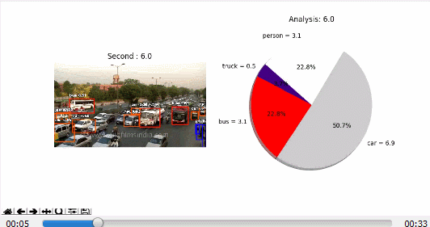

.. ImageAI documentation master file, created by
   sphinx-quickstart on Tue Jun 12 06:13:09 2018.
   You can adapt this file completely to your liking, but it should at least
   contain the root `toctree` directive.

Official English Documentation for ImageAI!
===========================================
**ImageAI** is a python library built to empower developers, reseachers and students to build applications and systems with self-contained Deep Learning and Computer Vision capabilities using simple and few lines of code.
This documentation is provided to provide detailed insight into all the classes and functions available in **ImageAI**, coupled with a number of code examples.
**ImageAI** is a project developed by `Moses Olafenwa <https://twitter.com/OlafenwaMoses>`_.

The Official GitHub Repository of **ImageAI** is `https://github.com/OlafenwaMoses/ImageAI <https://github.com/OlafenwaMoses/ImageAI />`_

---------------------------------
ImageAI now uses PyTorch backend.
---------------------------------

For full details on this and if you plan on using existing Tensorflow pretrained models, custom models and Pascal VOC dataset, visit the `BACKEND_MIGRATION.md documentation <https://github.com/OlafenwaMoses/ImageAI/blob/master/BACKEND_MIGRATION.md>`_.

.. figure:: image1.jpg
   :align:  center

Installing ImageAI
==================

**ImageAI** requires that you have Python 3.7.6 installed as well as some other Python libraries and frameworks. Before you install **ImageAI**, you must install the following dependencies.

* `Download and Install <https://www.python.org/downloads/>`_ **Python 3.7**, **Python 3.8**, **Python 3.9** or **Python 3.10**
* Install Dependencies (CPU) ::

    pip install cython pillow>=7.0.0 numpy>=1.18.1 opencv-python>=4.1.2 torch>=1.9.0 --extra-index-url https://download.pytorch.org/whl/cpu torchvision>=0.10.0 --extra-index-url https://download.pytorch.org/whl/cpu pytest==7.1.3 tqdm==4.64.1 scipy>=1.7.3 matplotlib>=3.4.3 mock==4.0.3
* Install Dependencies (GPU/CUDA) ::

    pip install cython pillow>=7.0.0 numpy>=1.18.1 opencv-python>=4.1.2 torch>=1.9.0 --extra-index-url https://download.pytorch.org/whl/cu102 torchvision>=0.10.0 --extra-index-url https://download.pytorch.org/whl/cu102 pytest==7.1.3 tqdm==4.64.1 scipy>=1.7.3 matplotlib>=3.4.3 mock==4.0.3
* If you plan to train custom AI models, run the command below to install an extra dependency ::

    pip install pycocotools@git+https://github.com/gautamchitnis/cocoapi.git@cocodataset-master#subdirectory=PythonAPI

* **ImageAI** ::

    pip install imageai --upgrade

Once **ImageAI** is installed, you can start running very few lines of code to perform very powerful computer visions tasks as seen below. 

**Image Recognition**

*Recognize 1000 different objects in images*

.. figure:: image2.jpg
   :align:  center

* convertible : 52.459555864334106
* sports_car : 37.61284649372101
* pickup : 3.1751200556755066
* car_wheel : 1.817505806684494
* minivan : 1.7487050965428352

`Visit Documentation <prediction>`_

**Image Object Detection**

*Detect 80 most common everyday objects in images.*

.. figure:: image3.jpg
   :align:  center

`Visit Documentation <detection>`_

**Video Object Detection**

*Detect 80 most common everyday objects in videos.*

.. figure:: image4.gif
   :align:  center

`Visit Documentation <video>`_

**Video Detection Analysis**

*Generate time based analysis of objects detected in videos.*

`Visit Documentation <video>`_

**Custom Image Recognition Training and Inference**

*Train new image new deep learning models on recognize custom objects*

.. figure:: image6.jpg
   :align:  center

`Visit Documentation <custom>`_

**Custom Objects Detection Training and Inference**

*Train new YOLOv3 models to detect custom objects*

.. figure:: image7.jpg
   :align:  center

`Visit Documentation <customdetection>`_

Follow the links in the **Content** section below to see all the code samples and full documentation of available classes and functions.

.. toctree::
   :maxdepth: 2
   :caption: Contents:

   prediction/index
   detection/index
   video/index
   custom/index
   customdetection/index

Indices and tables
==================

* :ref:`genindex`
* :ref:`modindex`
* :ref:`search`
